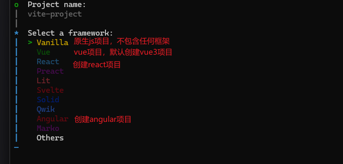

### 简介
[Vite](https://cn.vitejs.dev/) 是一个超快的前端构建工具，赋能下一代 Web 应用的发展

### 使用 vite 创建项目

```bash
# npm
npm create vite@latest

# yarn
yarn create vite

# pnpm
pnpm create vite
```
在命令行窗口中执行以上命令，出现如下提示



根据提示输入项目名称和选择的框架，即可创建一个基于 Vite 的项目，

### 创建 vue3 项目
直接在命令行窗口中执行以上命令，根据提示选择 vue 可直接创建一个基于 vue3 的项目

### 创建 vue2 项目
:::details 创建 vue2 项目
- 在命令行窗口中执行 `npm create vite@latest` 命令， 选择 `Vanilla` 创建一个原生的js项目
- 要在 vite 里运行 `vue2` 项目，需要安装一个 `vite` 的插件：`vite-plugin-vue2`
  ```bash
  npm install vite-plugin-vue2 -D
  ```
  - 安装完成后，需要在更目录新建 `vite.config.js` 文件并配置插件
  ```js
  import { defineConfig } from 'vite'
  import { createVuePlugin } from 'vite-plugin-vue2'

  export default defineConfig({
    plugins: [createVuePlugin()],
  })
  ```
- 安装 `vue` 依赖  
  ```bash
  # vue官网显示 2.7.16 版本为最后稳定版本
  npm install vue@2.7.16 -S
  ```
  - 修改项目文件依赖关系
    - 在根目录下创建 `src` 目录，把 `main.js` 移到 `src` 目录里
    - 修改 `index.html`
    ```js
    <script type="module" src="/src/main.js"></script>
    ```
    - 在 src 目录下创建 `App.vue` 文件,并输入以下代码
    ```vue
    <template>
      <div>
        <h1>Hello Vue 2!</h1>
      </div>
    </template>
    ```
    - 修改（清空） `src` 目录下的 `main.js`
    ```js
    import Vue from 'vue'
    import App from './App.vue'

    new Vue({
      render: h => h(App)
    }).$mount('#app')
    ```
  - 启动项目
  ```bash
  npm run dev 
  ```
- 安装 `vue-route`
  ```bash 
  npm install vue-router@3.x -S
  ``` 
  - 配置 `vue-router`
    - 在 `src` 目录下创建 `router` 目录，在 `router` 目录下创建 `index.js` 文件
    ```js
    import Vue from 'vue'
    import Router from 'vue-router'

    Vue.use(Router)

    const routes = [
      {
        path: '/',
        name: 'home', 
        component: () => import('../views/home.vue')
      },
      {
        path: '/about',
        name: 'about', 
        component: () => import('../views/about.vue')
      }
    ]

    export default new Router({
      routes,
      mode: 'history'
    })
    ```
    - 在 src 目录下创建 views 目录，用来存放页面组件。
      - 在 `views` 目录下创建 `home.vue` 、`about.vue`文件，并输入以下代码
      - home.vue
      ```vue
      <template>
        <div>
          <h1>Home</h1>
        </div>
      </template>
      ```
      - about.vue
      ```vue
      <template>
        <div>
          <h1>About</h1>
        </div>
      </template>
      ```
      - 配置 `vue-router` 到 `vue` 实例中
      ```js
       // main.js 文件
      import router from './router'

      new Vue({
        router,
        render: h => h(App)
      }).$mount('#app')
      ```
    - 修改 App.vue 文件
    ```vue
    <template>
      <div>
        <nav>
          <router-link to="/">Home</router-link> |
          <router-link to="/about">About</router-link>
        </nav>
        <router-view />
      </div>
    </template>
    ```
- 安装 `vuex`
  ```bash
  # vue2 版本支持的最后稳定版本
  npm install vuex@3.x -S
  ```
  - 配置 `vuex`
    - 在 `src` 目录下创建 `store` 目录，在 `store` 目录下创建 `index.js` 文件
    ```js
    import Vue from 'vue'
    import Vuex from 'vuex'

    Vue.use(Vuex)

    export default new Vuex.Store({
      state: {
        count: 0
      },
      mutations: {
        increment(state) {
          state.count++
        }
      }
    })
    ```
    - 配置 `vuex` 到 `vue` 实例中
    ```js
    // main.js 文件
    import store from './store'

    new Vue({
      store,
      render: h => h(App)
    }).$mount('#app')
    ```
::: 
